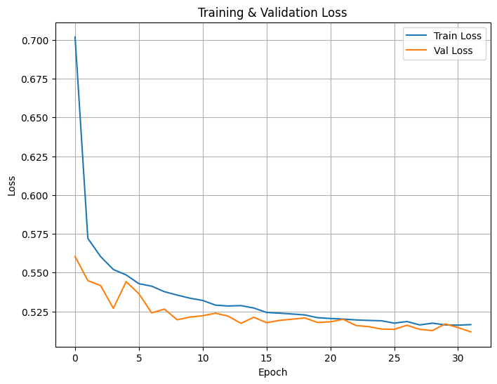
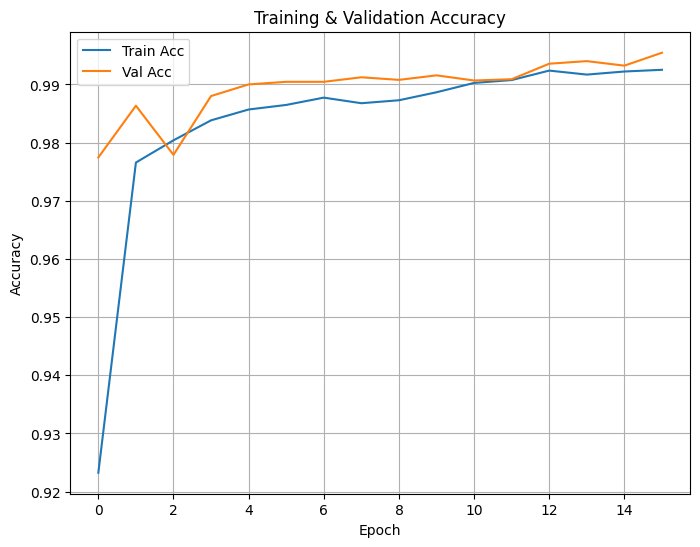
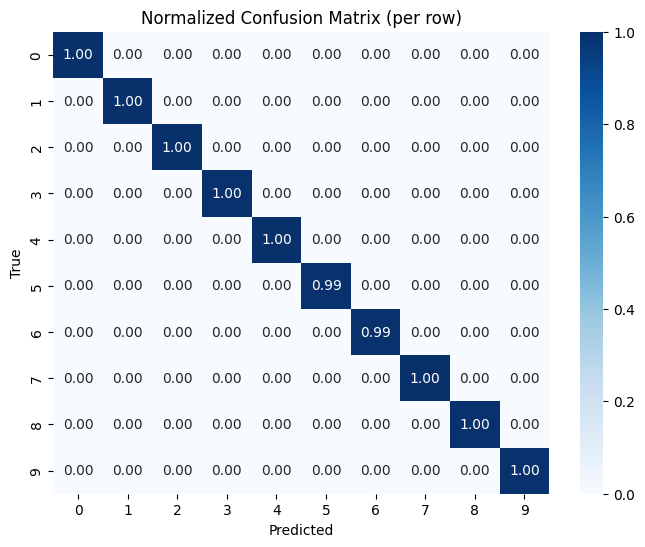
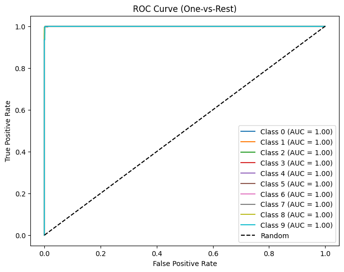

# 🧠 MÔ HÌNH CNN PHÂN LOẠI CHỮ SỐ VIẾT TAY – MNIST  

> Mô hình Convolutional Neural Network (CNN) huấn luyện trên tập dữ liệu **MNIST** để phân loại chữ số viết tay (0–9).  
> README này trình bày chi tiết kết quả, báo cáo phân loại và các hình ảnh minh họa trực quan.  

---

## 📂 1. Tập dữ liệu  

- **Nguồn**: MNIST (Yann LeCun et al.).  
- **Kích thước**:  
  - 60.000 ảnh huấn luyện.  
  - 10.000 ảnh kiểm tra.  
- **Đặc điểm ảnh**:  
  - Grayscale.  
  - Kích thước **28×28 pixel**.  

---

## 🎯 2. Kết quả tổng quan  

| Metric           | Giá trị |
|-----------------|----------|
| **Accuracy**    | 0.9973   |
| **Macro Precision** | 0.9973   |
| **Macro Recall**    | 0.9972   |
| **Macro F1-score**  | 0.9973   |

---

## 📈 5. Hình ảnh minh họa  

### 🔹 Quá trình huấn luyện  

- **Biểu đồ Loss:**

  

- **Biểu đồ Accuracy:**

  

### 🔹 Đánh giá mô hình  

- **Ma trận nhầm lẫn (Confusion Matrix):**

  

- **Đường cong ROC (ROC Curve):**

  

---

## ✨ 6. Nhận xét  

> Mô hình CNN đạt **độ chính xác cao** nhờ:
> - Kiến trúc tối ưu cho nhận dạng ảnh số viết tay.
> - Sử dụng **regularization** và **data augmentation** hợp lý.
> - Quy trình huấn luyện và đánh giá nhất quán trên tập MNIST.

---

