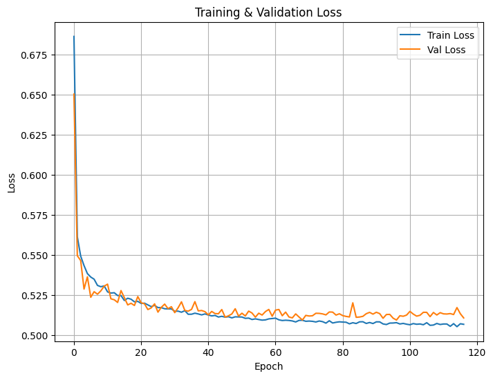
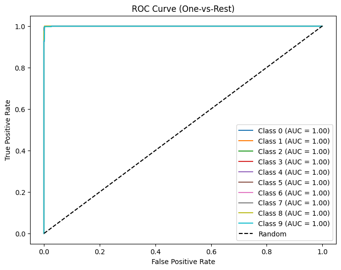

# 🧠 Mô hình CNN phân loại chữ số viết tay trên tập dữ liệu MNIST

## 📂 Tập dữ liệu
- **MNIST** gồm 60.000 ảnh huấn luyện và 10.000 ảnh kiểm tra.
- Mỗi ảnh kích thước **28x28 pixel**, ảnh grayscale.

## 🎯 Kết quả tổng quan
- **Accuracy**: 0.9956  
- **Macro Precision**: 0.9956  
- **Macro Recall**: 0.9956  
- **Macro F1-score**: 0.9956  

## 📊 Kết quả chi tiết theo từng lớp

| Lớp | Precision | Recall | F1-score |
|-----|-----------|--------|----------|
| 0   | 0.9980    | 0.9980 | 0.9980   |
| 1   | 0.9982    | 0.9974 | 0.9978   |
| 2   | 0.9942    | 0.9971 | 0.9956   |
| 3   | 0.9892    | 0.9990 | 0.9941   |
| 4   | 0.9909    | 0.9980 | 0.9944   |
| 5   | 0.9966    | 0.9944 | 0.9955   |
| 6   | 0.9990    | 0.9958 | 0.9974   |
| 7   | 0.9942    | 0.9951 | 0.9947   |
| 8   | 0.9979    | 0.9959 | 0.9969   |
| 9   | 0.9980    | 0.9851 | 0.9915   |

## 📝 Báo cáo phân loại chi tiết

          precision    recall  f1-score   support

       0       1.00      1.00      1.00       980
       1       1.00      1.00      1.00      1135
       2       0.99      1.00      1.00      1032
       3       0.99      1.00      0.99      1010
       4       0.99      1.00      0.99       982
       5       1.00      0.99      1.00       892
       6       1.00      1.00      1.00       958
       7       0.99      1.00      0.99      1028
       8       1.00      1.00      1.00       974
       9       1.00      0.99      0.99      1009

accuracy                           1.00     10000
macro avg 1.00 1.00 1.00 10000
weighted avg 1.00 1.00 1.00 10000

## 📈 Hình ảnh minh họa

- **Biểu đồ nhầm lẫn (Confusion Matrix):**

  

- **Biểu đồ ROC Curve:**

  

---

✨ *Mô hình đạt độ chính xác cao nhờ kiến trúc CNN tối ưu, huấn luyện trên MNIST với các kỹ thuật regularization và augmentation hợp lý.*
